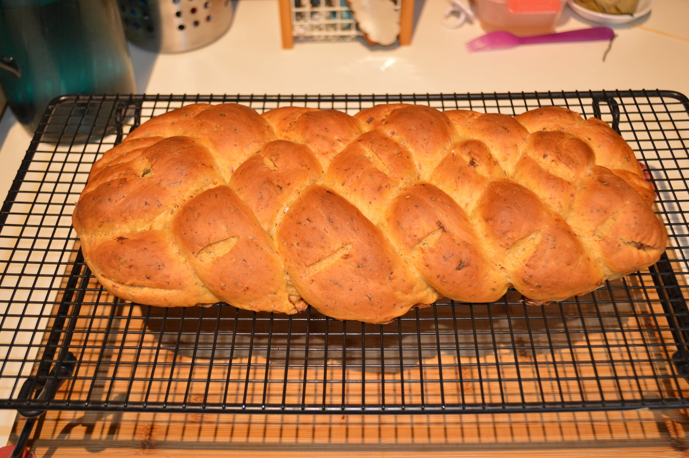
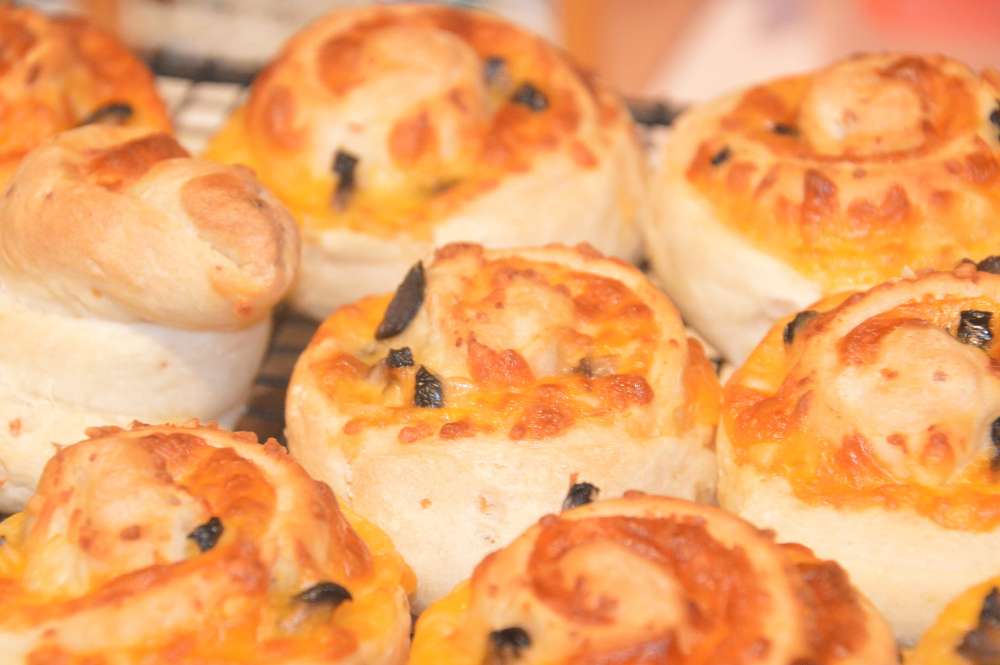
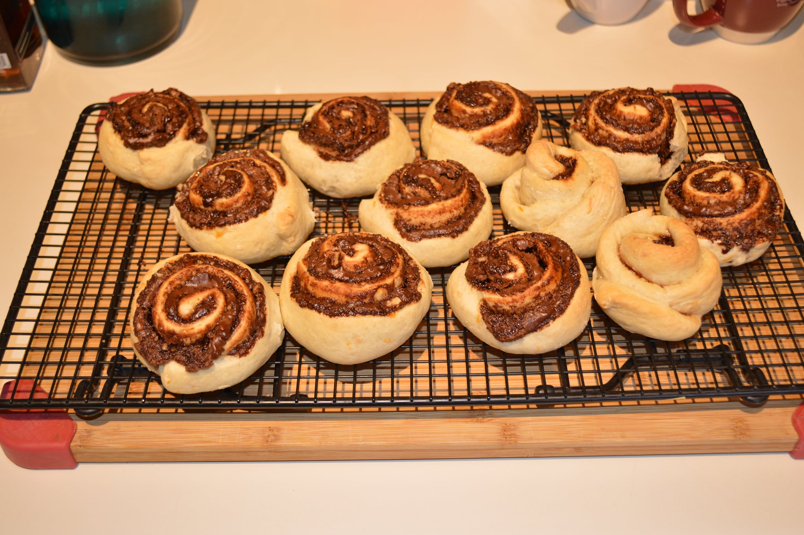
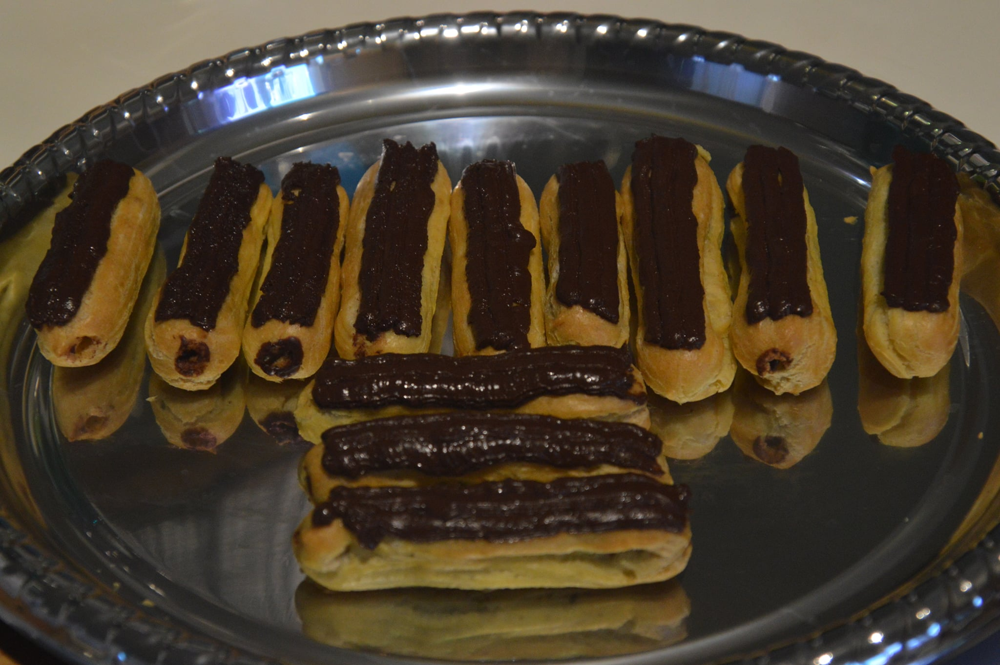
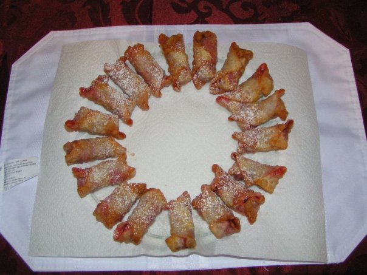

# Recipes
A collection of recipes that I've made and like.  For best results, read
the PDF and not the TEX file (unless you're interested in LaTeX).

I'd be interested in hearing the results if anyone tries these.

## Contents
### Breads
* Basic Bread
* Sun-dried Tomato Basil Bread (this is one of my favorites)

* Herb Bread (still need to get the balance of herbs right)
* Generic rolls

### Pies and Related
* Easy Shepherd's Pie/Pot Pie
* Easy Quiche
* Frittatas

### Cakes and Related
* Chocolate Cheesecake Bars (Needs a little work, but quite good)

### Cookies
* Oatmeal Chocolate Chip
* Gingerbread

### Pastries
* Choux Pastry
* Shortcrust Pastry
* Eclairs

* Deep Fried Raspberry-Chocolate Wraps

* Cannoli

### Extras
* Coconut Cream Chocolate Mousse (good if you like coconut)
* Tofu Chocolate Mousse (not bad, but needs a little work)
* Tofu Raspberry Mousse (needs work)
* Chocolate Ganache (quite good)
* Caramel and Spun Sugar
* Manicotti filling
* Cannoli filling

### Tips and Techniques
* Chiffonade
* Grating Baking Chochlate
* Melting Chocolate
* Braiding (for breads - up to 5 strands)
